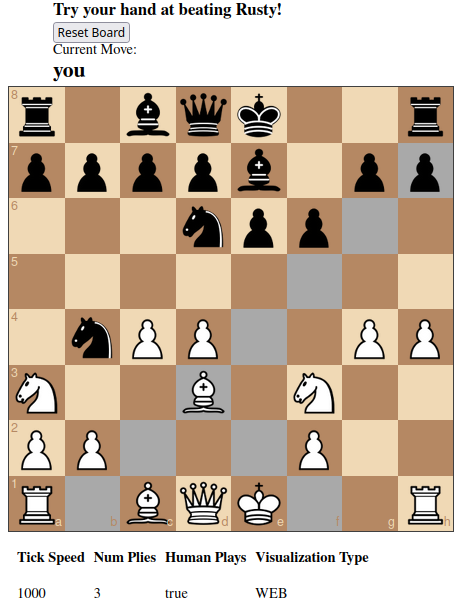
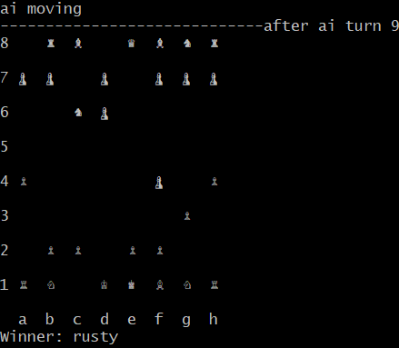

[![Contributors][contributors-shield]][contributors-url]
[![Forks][forks-shield]][forks-url]
[![Stargazers][stars-shield]][stars-url]
[![Issues][issues-shield]][issues-url]
[![MIT License][license-shield]][license-url]
[![LinkedIn][linkedin-shield]][linkedin-url]

# Chrust: Chess + Rust <3

<p float="left">
  <a href="https://github.com/johnyenter-briars/chrust">
    
  </a>
  <a href="https://github.com/johnyenter-briars/chrust">
    
  </a>
</p>

## About Chrust

<!-- [![Product Name Screen Shot][product-screenshot]](https://example.com) -->

Chrust is a chess engine written in Rust. (Very original I know). This is also an opportunity for me to learn rust above a beginner level and maybe build something kinda cool

Chrust supports the standard Minimax algorighm, A+B pruning, and Piece-Square tables for its decision making.

I'm by no means a Rust expert, so if you see any issues in the source code please don't hesitate to show me where I'm stupid.


### Built With

* [Rust](https://www.rust-lang.org/)
* [Rocket](https://rocket.rs/)
* [ChessBoard.js](https://chessboardjs.com/)

## Getting Started

To try your hand at beating rusty, either: 

1: go to the [releases](https://github.com/johnyenter-briars/chrust/releases) tab and download the latest binary

2: Build and run from source

### Prerequisites for Running From Source

[Rust](https://www.rust-lang.org/) tooling installed.

### Running Chrust
Clone the source code and navigate to the root directory, and run:
```sh
cargo run -- <args>
```
If running over the Web (default), navigate to a browser and then go to either [localhost:8000](http://localhost:8000) or [127.0.0.1:8000](http://127.0.0.1:8000)

## Usage

The binary currently supports several command line arguments.

```sh
./chrust [-z "TERM"|"WEB"] [-t TICK_SPEED] [-h HUMAN_PLAYS] [-p NUM_PLIES]
```

| Flag | Name | Description |
| ----------- | ----------- | ----------- |
| z | visulization_mode | Sets the visulization mode of the program - either Unicode on the terminal, or graphical in the browser over localhost |
| t | tick_speed | Sets the interval between moves in milliseconds | 
| h | human_plays | Sets whether or not the human player will play the game. If false, the human player makes random decisions | 
| p | num_plies | Sets the number of turns (plies) the AI will look ahead. Becareful on numbers > 4, as the program will become ungodly slow | 

For a complete description on the arguments, run using the `--help` flag.

## Prerelease

The second Chrust prerelease is completed! Checkout the prerelase here: [0.2.0](https://github.com/johnyenter-briars/chrust/releases/tag/0.2.0)

To run the program, unzip the archive pertaining to your operating system, and run the appropriate binary.

Any feedback is welcome! 

## Building For Release

The newest release of Chrust can be found [here](https://github.com/johnyenter-briars/chrust/releases)

If you wish to build in release mode yourself, build scripts are located in the repo root and titled `build_<platform>.<extension>`.

The build script will place the built binary in the `release` folder, under the sub folder named after the platform (win|mac|linux).

#### Dependencies to Build on Windows

* Rust target profile: x86_64-pc-windows-msvc
* Visual C++ tool chain

#### Dependencies to Build on MacOS

* Rust target profile: x86_64-apple-darwin
* XCode tool chain

## License

Distributed under the MIT License. See `LICENSE` for more information.

## Contact

John Yenter-Briars - <jyenterbriars@gmail.com>

Project Link: [https://github.com/johnyenter-briars/chrust](https://github.com/johnyenter-briars/chrust)


## Acknowledgements

* [The Good People of the Rust Discord](https://discord.com/invite/rust)


[contributors-shield]: https://img.shields.io/github/contributors/johnyenter-briars/chrust.svg?style=plastic
[contributors-url]: https://github.com/johnyenter-briars/chrust/graphs/contributors
[forks-shield]: https://img.shields.io/github/forks/johnyenter-briars/chrust.svg?style=plastic
[forks-url]: https://github.com/johnyenter-briars/chrust/network/members
[stars-shield]: https://img.shields.io/github/stars/johnyenter-briars/chrust.svg?style=plastic
[stars-url]: https://github.com/johnyenter-briars/chrust/stargazers
[issues-shield]: https://img.shields.io/github/issues/johnyenter-briars/chrust.svg?style=plastic
[issues-url]: https://github.com/johnyenter-briars/chrust/issues
[license-shield]: https://img.shields.io/github/license/johnyenter-briars/chrust.svg?style=plastic
[license-url]: https://github.com/johnyenter-briars/chrust/blob/master/LICENSE
[linkedin-shield]: https://img.shields.io/badge/-LinkedIn-black.svg?style=plastic&logo=linkedin&colorB=555
[linkedin-url]: https://linkedin.com/in/johnyenter-briars
[product-screenshot]: images/screenshot.png