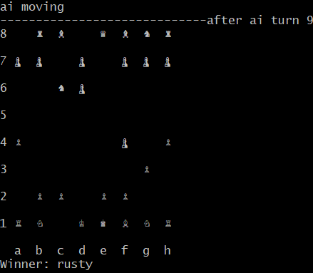

[![Contributors][contributors-shield]][contributors-url]
[![Forks][forks-shield]][forks-url]
[![Stargazers][stars-shield]][stars-url]
[![Issues][issues-shield]][issues-url]
[![MIT License][license-shield]][license-url]
[![LinkedIn][linkedin-shield]][linkedin-url]


<!-- PROJECT LOGO -->
<br />
<div style="display: flex; line-height: 60px;">
  <div>
    <h3 align="center">Chrust</h3>
    <p align="center">
      Chess + Rust <3. Chess engine written in Rust. 
      <br />
      <a href="https://github.com/johnyenter-briars/chrust">View Demo</a>
      ·
      <a href="https://github.com/johnyenter-briars/chrust/issues">Report Bug</a>
      ·
      <a href="https://github.com/johnyenter-briars/chrust/issues">Request Feature</a>
    </p>
  </div>
  <p align="right">
    <a href="https://github.com/johnyenter-briars/chrust">
      
    </a>
  </p>
</div>


<!-- ABOUT THE PROJECT -->
## About Chrust

<!-- [![Product Name Screen Shot][product-screenshot]](https://example.com) -->

Chrust is a chess engine written in Rust. (Very original I know). This is also an opportunity for me to learn rust above a beginner level.

Chrust supports the standard Minimax algorighm for its decision making, and will expand to include other heuristics and optimizations. 

I'm by no means a Rust expert, so if you see any issues in the source code please don't hesitate to show me where I'm stupid.


### Built With

* [Rust](https://www.rust-lang.org/)
* [Rocket](https://rocket.rs/)
* [ChessBoard.js](https://chessboardjs.com/)

<!-- GETTING STARTED -->
## Getting Started

To try your hand at beating rusty, follow the standard installation steps:

### Prerequisits

[Rust](https://www.rust-lang.org/) tooling installed.

### Installation

1. Clone the repo
   ```sh
   git clone https://github.com/johnyenter-briars/chrust.git
   ```
2. Build the project
   ```sh
   cargo build
   ```
3. Run the project
   ```sh
   cargo run -- <args>
   ```

### Building For Release

The newest release of Chrust can be found [here](https://github.com/johnyenter-briars/chrust/releases)

If you wish to build in release mode yourself, build scripts are located in the repo root and titled `build_<platform>.<extension>`.

The build script will place the built binary in the `release` folder, under the sub folder named after the platform (win|mac|linux).

Note: the binary expects to be run in the same execution context as the `static` folder.

#### Dependencies to Build on Windows

* Rust target profile: x86_64-pc-windows-msvc
* Visual C++ tool chain

#### Dependencies to Build on MacOS

* Rust target profile: x86_64-apple-darwin
* XCode tool chain

<!-- USAGE EXAMPLES -->
## Usage

The binary currently supports several command line arguments.

```
./chrust [-z TERM|WEB] [-t TICK_SPEED] [-h HUMAN_PLAYS] [-p NUM_PLIES]
```

| Flag | Name | Description |
| ----------- | ----------- | ----------- |
| z | visulization_mode | Sets the visulization mode of the program - either Unicode on the terminal, or graphical in the browser over localhost |
| t | tick_speed | Sets the interval between moves in milliseconds | 
| h | human_plays | Sets whether or not the human player will play the game. If false, the human player makes random decisions | 
| p | num_plies | Sets the number of turns (plies) the AI will look ahead. Becareful on numbers > 4, as the program will become ungodly slow | 

For a complete description on the arguments, run:

```
./chrust --help
```


<!-- ROADMAP -->
## Roadmap

The scope and capabilities of the project will grow and expand as my knowledge of Rust grows and my freetime either inflates or contracts.

Currently, the list of features I would like to add are outlined below.

### AI Features
- [X] MiniMax Implementation
- [X] Alpha-Beta Pruning
- [X] Piece-Square Tables
- [ ] Move Ordering
- [ ] Transposition Tables
- [ ] Quiescence search

### Visual Features
- [X] Terminal UI
- [ ] GUI
- [X] Web

### 'Program Ease of Use' Features
- [ ] Access to mutable AI difficulty settings
- [ ] Game saves/loads/history

## Prerelease

The first Chrust prerelease is completed! Checkout the prerelase here: [0.1.0](https://github.com/johnyenter-briars/chrust/releases/tag/0.1.0)

Any feedback on any part of the codebase would be greatly appreciated!

To run the program, unzip the archive pertaining to your operating system, and run the appropriate binary.


<!-- CONTRIBUTING -->
## Contributing

Feel free to fork, update, change, modify as you see fit. If you would like to explicitly contribute to this project, I would love it if you:

1. Fork the Project
2. Create your Feature Branch (`git checkout -b feature/FeatureToChrust`)
3. Commit your Changes (`git commit -m 'Add some cool stuff'`)
4. Push to the Branch (`git push origin feature/FeatureToChrust`)
5. Open a Pull Request


<!-- LICENSE -->
## License

Distributed under the MIT License. See `LICENSE` for more information.


<!-- CONTACT -->
## Contact

John Yenter-Briars - <jyenterbriars@gmail.com>

Project Link: [https://github.com/johnyenter-briars/chrust](https://github.com/johnyenter-briars/chrust)


<!-- ACKNOWLEDGEMENTS -->
## Acknowledgements

* [The Good People of the Rust Discord](https://discord.com/invite/rust)


[contributors-shield]: https://img.shields.io/github/contributors/johnyenter-briars/chrust.svg?style=plastic
[contributors-url]: https://github.com/johnyenter-briars/chrust/graphs/contributors
[forks-shield]: https://img.shields.io/github/forks/johnyenter-briars/chrust.svg?style=plastic
[forks-url]: https://github.com/johnyenter-briars/chrust/network/members
[stars-shield]: https://img.shields.io/github/stars/johnyenter-briars/chrust.svg?style=plastic
[stars-url]: https://github.com/johnyenter-briars/chrust/stargazers
[issues-shield]: https://img.shields.io/github/issues/johnyenter-briars/chrust.svg?style=plastic
[issues-url]: https://github.com/johnyenter-briars/chrust/issues
[license-shield]: https://img.shields.io/github/license/johnyenter-briars/chrust.svg?style=plastic
[license-url]: https://github.com/johnyenter-briars/chrust/blob/master/LICENSE
[linkedin-shield]: https://img.shields.io/badge/-LinkedIn-black.svg?style=plastic&logo=linkedin&colorB=555
[linkedin-url]: https://linkedin.com/in/johnyenter-briars
[product-screenshot]: images/screenshot.png